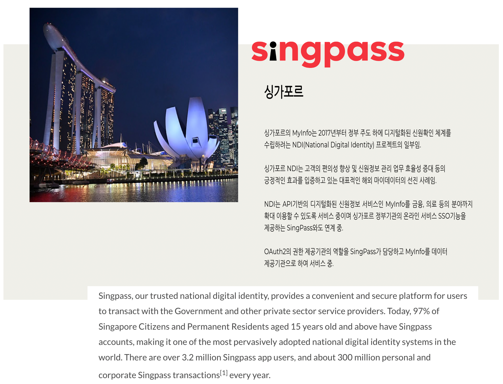

# myinfo-connector-python API



## About myinfo-connector-python&#x20;

For Python/Django Connector for Singapore government mydata service, Singpass myinfo. MyInfo Connector aims to simplify consumer's integration effort with MyInfo by providing an easy to use Python library to integrate into your application.\

## About Myinfo

\
Myinfo enables citizens and residents to manage the use of their personal data for simpler online transactions.All Singpass users are automatically provisioned with a Myinfo profile. Users are able to view their personal data and access records of past usage via the [Singpass app](https://singpassmobile.sg/).\
How Myinfo API can enhance your digital service\
\

* Less form filling, higher data quality\
  Users can share their data by providing consent via Singpass and organisations no longer have to deal with manual data management.\
  \

* Data from government sources\
  With data from participating government sources, this allows the provisioning of products instantly, where applicable.

